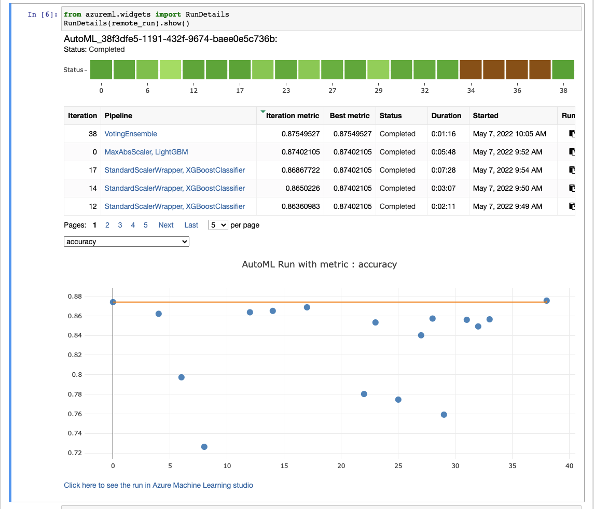
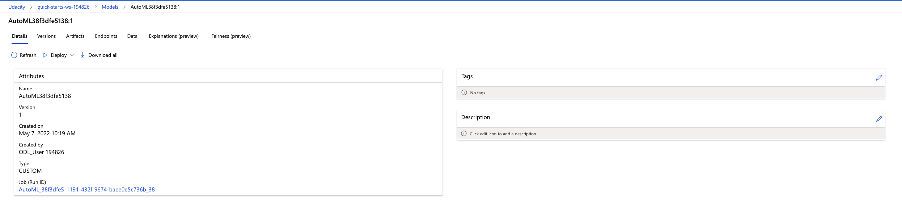
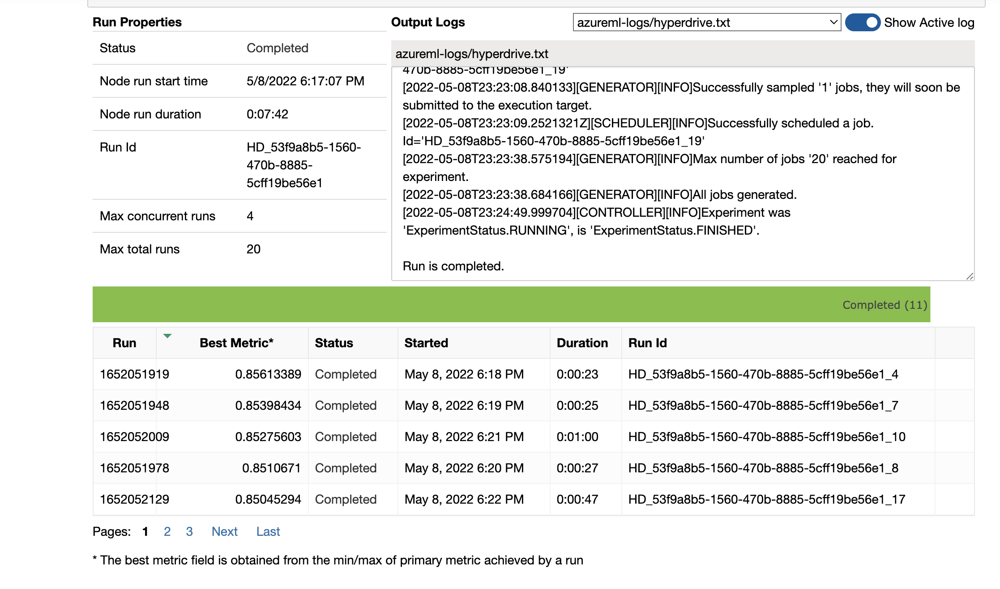
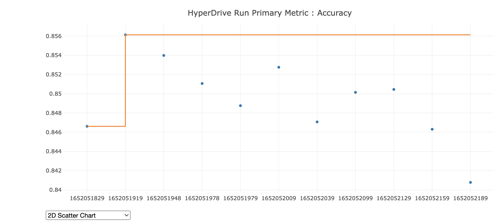
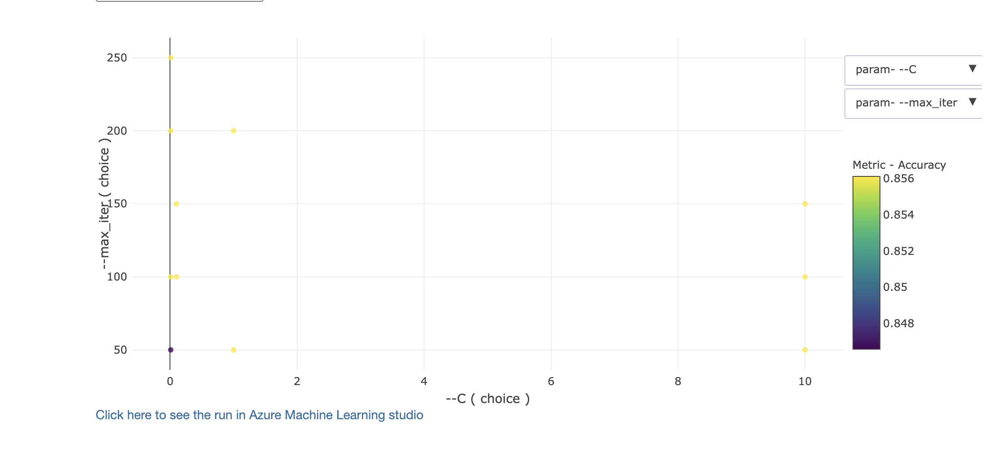
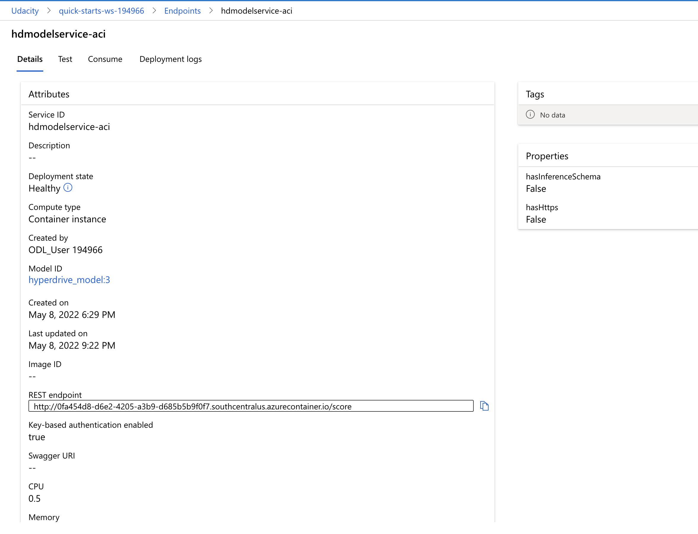

# Udacity Azure Machine Learning Engineer Capstone - Salary Prediction project

For this capstone project I will be using the tools offered by AzureML to upload a dataset, train a variety of models with AutoML, train a model and tune its hyper parameters with hyperdrive, and lastly deploy the best performing model. After the model is deployed I will be testing to ensure the it gives a prediction.

## Dataset

### Overview
The data set I choose is for salary prediction classification. It contains demographics and wage data from the 1994 United States Census. It also has a column the indicates whether the person make more or less than $50,000 anually. The data can be found on kaggle at this [link](https://www.kaggle.com/datasets/ayessa/salary-prediction-classification). The dataset features are listed below:

Dataset Features:
* **age**: The age of the person (int)
* **workclass**: The class of job for the person (string category)
* **fnlwgt**: Weight assigned by US Census Bureau for number of people represented by that entry (int)
* **education**: The type of education someone has received (string category) (this column was dropped as it has the data as the education-num column)
* **education-num**: A numerical representation of the education column (int)
* **marital-status**: The marital status of a person (string category)
* **occupation**: The occucpation of a person (string category)
* **relationship**: The family relationship of a person (string category)
* **race**: The ethnicity of a person in the report (string category)
* **sex**: The gender of the person in the report (string category)
* **capital-gain**: The capital gains of a person in the report (int)
* **capital-loss**: The capital losses of a person in the report (int)
* **hour-per-week**: Hours worked per work (int)
* **native-country**: The native country for the person in the report (int)
* **salary**: The salary <=50K or >50K we are trying to predict (category)
### Task
The goal is to take the demographic and wage data an use it to predict whether a person will make more or less than $50,000.

### Preprocessing

I took a few steps to preprocess the data before doing the hyperdrive and automl experiments the code for this can be found in the prep_data function [here](./train.py). There were two main approaches I took, for the numerical data I used a [StandardScaler](https://scikit-learn.org/stable/modules/generated/sklearn.preprocessing.StandardScaler.html) to standardize the features. I saved the scaler values from the initial dataset and used them to scale data when I made predictions in [score.py](./score.py). For cateforical data I decided to One Host Encode the the categories the [get_dummies](https://pandas.pydata.org/docs/reference/api/pandas.get_dummies.html) function from pandas because the categories don't have any ranking so they I wanted them all to be treated evenly.
### Access
To access the data in my workspace I uploaded the [csv](./salary.csv) as dataset in azureml by uploading it from my machine. I then used the below snippet of code to get access to it:
```python
from azureml.core.dataset import Dataset
dataset = Dataset.get_by_name(ws, name='salary')
df = dataset.to_pandas_dataframe()
```

## Automated ML

For automl I used the below configurations to try and find a model that would give the best accuracy for predictions with my dataset.

Configurations:
* **task**: Set to 'classification' since our goal is to classify a person's salary
* **experiment_timeout_minutes**: Set to 30 minutes to get results in a timely manner and to not waste resources
* **primary_metric**: Set to 'accuracy' because its a reasonable metric to determine the outcome in a classification
* **label_column**: Set to the result column from the dataset, the salary being more or less than 50k, which is what is being predicted
* **compute_target**: The compute cluster to run the experiment on
* **n_cross_validations**: Set to 5 to remove bias when doing validation
* **enable_early_stopping**: Terminate the experiment early if the score isn't improving
* **max_concurrent_iterations**: Allow for multiple runs to be done in parallel

### Results

THe results yielded a variety of good models including the best model being which used the VoteEnsemble pipeline and yield accruacy results of 0.875. The mode had a variety of parameters which can be seen [automl.ipynb](./automl.ipynb). I think the model could be improved with more time to try different models I also think that more data would help to increase the accuracy. Below are screenshots from azureml studio.

#### **Automl RunDetails:**


#### **Best AutoML Mode:**



## Hyperparameter Tuning
*TODO*: What kind of model did you choose for this experiment and why? Give an overview of the types of parameters and their ranges used for the hyperparameter search

I choose a [LogisticRegression](https://scikit-learn.org/stable/modules/generated/sklearn.linear_model.LogisticRegression.html) model for this experiment because its a binary classification and it got pretty good results in my initial testing. I explored the data in [data.ipynb](./data.ipynb) and decided to use LogisticRegresiong over SVM and K nearest neighbors. I felt I could tune the hyperparameters to get even better results. I choose to tune C which determines the regularization and max_iter which is the number of iterations for the solvers to converge.


### Results

The best result I got was an accuracy of 0.857 with a C value of 0.1 and max_iter value of 250. I think this could be improved more by trying even more hyperparameters or by using Bayesian Sampling instead of Random Sampling.

#### **HyperDrive RunDetails:**



## Model Deployment

I deployed my hyperdrive model using [score.py](./score.py) in the [hyperdrive notebook](./hyperparameter_tuning.ipynb) and wrote a bit of code to preprocess input request to match the preprocessing I did for the model. An example request with input can be found in the notebook. The input data needed to be scaled and one hot encoded to be suitable for the model. The endpoint can be queried with data in the same format as the [salary dataset](./salary.csv) by using a post request to the endpoint.

#### **Deployed Healthy Mode:**


## Screen Recording

https://youtu.be/TFqc4OOcEzY

